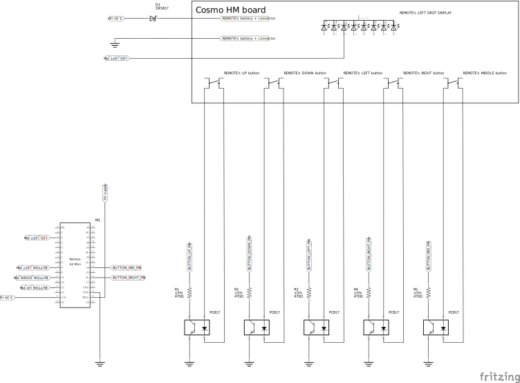

# Roller blinds adapter

Simple MQTT adapter on top of COSMO HM remote control.

# Purpose of the project

I have Mobilus roller blinds motors mounted at my home and some day decided to add them to Home Assistant to be able to add some automations - mostly for closing shades depending on sun conditions and temperature in summer.
It appears that there is no vendor supported solution that would allow to do this out of the box. At least all google searches pointed me to forums were users complained about lack of solution.
Having COSMO HM remote controller lying around in my drawer I decided to try to add some arduino layer on top of it to expose it as a MQTT gate - for easy integrations with Home Assistant.

That is how this project was born. It took me about 3 days to hack a partially working version. After some polishing it become robust enough to use it in my home automations. I decided to share it with community.
Perhaps somebody will feel adventurous enough to make his own version of this project.

# How does it work

The principle behind the idea is pretty simple. Arduino program connects to your Wi-Fi network and subscribes to a MQTT messages on a ```mobilus/blinds/command``` topic.

Messages have syntax: ```<command> <number>```
* ```command``` is one of: ```UP```, ```DO```, ```ST```, ```NO```, for raise, lower, stop and nop operations.
Nop operation does nothing apart from navigating to requested blind number - can be used for testing purposes.
* ```number``` denotes the position of a blind.

Hence, invoking a command

```bash
mosquitto_pub -h <mqtt broker ip> -t mobilus/blinds/command -m 'up 20'
```
is going to raise a blind programmed as 20th position of a COSMO HM remote.
# Hardware connections 

Disclaimer: I am not an electronics professional and my knowledge of electronics is pretty basic (self learned). Although my circuit is working and is not going to burn the COSMO HM board it could be certainly done in more elegant way.

Basic assumptions:
- I use ```s2 mini``` board that I used for other projects. Choice of board is subjective - I could have used something less powerful, but this is already very cheap. 
- COSMO HM remote is normally powered from two AA batteries. Its normal operating voltage should be about 3V. 
  Power drawn during normal operations (measured by a multimeter) ranges from 30 to 60 mA it should be sufficient to be powered by a 3.3V rail of s2 mini. I use a Shottky diode to lower down voltage to under 3V.
- I decided to apply galvanic isolation between arduino board output pins and COSMO HM button connectors. Perhaps this is not needed, but I preferred to be on the safe side.
 
Here is a diagram of my circuit: 

## Algorithm details

### Synchronization

The main problem to tackle was dealing with the fact that COSMO HM remote restores current position after power off. There is no key sequence to move to blind 0 without knowing which blind is currently selected.

Hence, it was required to somehow deduce current position by reading current blind indicator. I thought that I would need to connect arduino inputs to all 28 segments of 2 digit display (2 * a-f segments of each digit),
but I noticed that one of segments ("c") is off only when digit "2" is displayed. So I ended connecting only two segments' pins to analog inputs of arduino.
Later it turned out that it sufficient to connect to only one of them. By trial end error I noticed that > 2V on that pin means that ```one of digits is displaying value of 2```.
This observation was crucial to code the ```synchronize()``` function. It is working by counting down endlessly until for 10 consecutive position changes one of digits is displaying value 2. When this happens we know that current position == 20.

Update: this has been simplified a bit in the latest implementation - synchronization function down detects if both "c" segments are off - this means that currently displayed value is "22".

## Tuning hardware 

I made some observations when using the adapter that allowed me to improve its behavior:
* I have 20 blinds installed, but limited number of available blinds in COSMO HM remote to 30
 (30 blinds is the smallest number that is supported by arduino code, because of how ```synchronize()``` is implemented. It expects to be able to switch from blind 29 to 20). Limiting blinds number to 30 makes synchronization procedure very fast.
* Sometimes remote failed to trigger one of blinds - I needed to publish respective command several times until it switched the motor. The solution was to enable ```SIGNAL REPEATER``` function of specific Mobilus ERS blinds. How to do it is described by Mobilus usage manuals.

## Video footage

1. Synchronization on power on:

   [01_synchronization.webm](https://github.com/pwrozycki/mobilus-blinds-adapter/assets/7523887/4956b844-3c2e-4d38-9e11-4a3b50804d67)
   
   Footage shows adapter counting down to reach value 20. After this short sequence adapter knows ```current position``` of remote and is ready to handle messages on subscribed topic.

3. Handling of 6 commands sent one after another:

   ```bash
   for i in 'up 8' 'up 9' 'up 10' 'st 8' 'st 9' 'st 10'  ; do  mosquitto_pub -h 192.168.1.8 -t mobilus/blinds/command -m "$i" ;done
   ```
   [02_sequence_of_commands.webm](https://github.com/pwrozycki/mobilus-blinds-adapter/assets/7523887/432c84b0-9d2d-4b7f-b43d-6074bc92fc4d)

   Although not shown in the footage, corresponding blinds 8, 9, 10 start raising and are stopped a moment later.

## HomeAssistant configuration

Configuration for home assistant is fairly simple. Once you add it you can use cover.kuchnia_w in your dashboards or automations.

```yaml
cover:
  - platform: template
    covers:
      kuchnia_w:
        device_class: blind
        friendly_name: "kuchnia_w"
        position_template: "{{ None }}"
        open_cover:
          - service: mqtt.publish
            data:
              payload: "up 1"
              topic: "mobilus/blinds/command"
        close_cover:
          - service: mqtt.publish
            data:
              payload: "do 1"
              topic: "mobilus/blinds/command"
        stop_cover:
          - service: mqtt.publish
            data:
              payload: "st 1"
              topic: "mobilus/blinds/command"
```
above example defines cover "1" with actions to open, close and stop cover.

Position_template needs  to be specified as ```{{None}}``` because otherwise HomeAssistant assumes optimistic behavior, disactivating lower / raise buttons depending on guessed state of a cover.

## Reliability

After 2 last reliability commits that addressed and successfully resolved:
- reconnection with MQTT / WiFi in event of temporary WiFi / MQTT server unavailability
- synchronization issues that were caused by overly aggressive timing.

I have been using this at in my home automation for 6 months. It turned out to be 100% robust & bulletproof